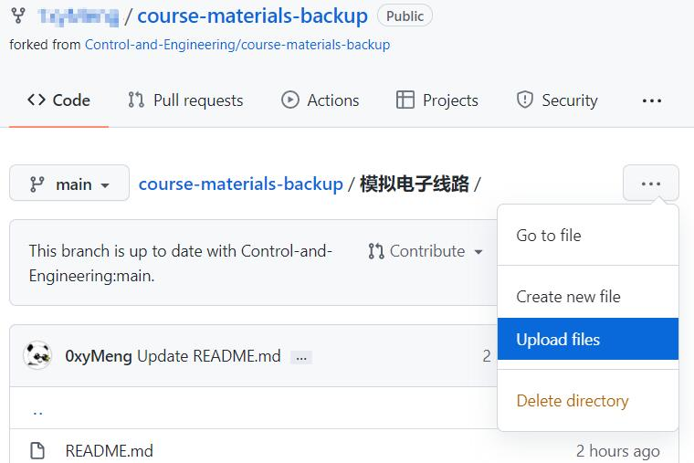
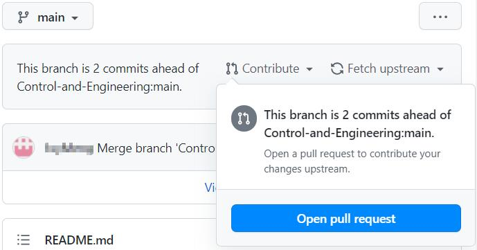

<br><br>

<center>
    
</center>

---

<br>


**如果你是在GitHub看到这些内容，欢迎前往[独立网页](https://课程.孝陵卫皇家理工大学.cn/)获得更好的访问体验。**

## 前言

这是一份和学习有关的开源文档。

一门课程再学习过程中会留下许多的学习痕迹：一些电子书、网络公开的学习课程、学习心得、走过的弯路。学会之后知识保存在大脑里，这些学习痕迹对个人而言就没用了，最终躺在硬盘里随着电脑一起报废。

这些学习痕迹，对于面对一个新知识体系不知如何下手的人来说，还是有价值的。因此我希望前人在学习路上踩过的坑，后来人都可以绕过，希望这些“痕迹”能产生一些新的价值。

## 主要内容

- 课程网络资源
- 参考教材
- 实验报告
- 小论文
- 考试相关的资料

包括但不限于上面列出的，一切对于知识的学习有帮助的内容。

## 欢迎贡献

如果你也愿意分享自己的学习心得、学习成果、好的学习资料，欢迎上传。

这些内容不建议上传
- 盗版、或需要付费的PDF电子书
- 破解软件及其安装包
- 课程ppt老师发布的资源等

*关于PPT：首先这属于老师的劳动成果，并且可能每年都会变化，也比较容易获得。其次PPT文件体积都挺大的，在github上传下载速度比较影响体验。*

如果确实需要，可以将跳转链接整理到README文档里。仓库里的文件侵犯了您的权益，请[向我们发送邮件](mailto:m@njust.edu.cn) ，我们会尽快清除。


### 上传方式

如果你熟悉git和GitHub，那么贡献方式和其他开源项目一样，只需要注意[文件组织方式](#文件组织方式)即可。

如果你从未听说过上面的东西，没关系，这里有一本[GitHub入门与实践](https://bookos-z1.org/book/2855761/e1777a)，学会这个版本控制工具对将来的软件项目开发一定会有用处。当然，如果你目前没有时间看完书里的这么多内容，按照[文件组织方式](#文件组织方式)整理好资料后，可以参考下面的简化版操作步骤及说明：

- 1.在[GitHub](https://github.com)注册一个自己的账号
>**GitHub**是一个软件项目平台，这个项目所有的文件、你看到的这个网页的代码全部都托管在这个平台上。如果你将来可能会从事软件开发工作，那么不妨现在先注册一个账号。

- 2.进入[本项目仓库](https://github.com/Control-and-Engineering/course-materials-backup)，点击右上角**Fork**
>此时你复制了项目*course-materials-backup*到你新注册的账号下。

- 3.1 上传文件到已有的课程文件夹
>这里以上传“模拟电路实验报告”为例。打开你账号里*course-materials-backup*项目中的`模拟电子线路`文件夹，点击**Upload files**，在打开的页面里上传你的文件，写上必要的说明文字，如`这是一份实验报告`。然后点击**Commit changes**，先提交到你的仓库。

<center>
    
</center>

- *3.2 上传文件到新课程*
>随便打开个课程文件夹，选择Upload files。**把浏览器地址栏中文件夹名称改为你想要新建的文件夹名称，回车确认**，其他步骤同上。

- 4.将你的更改提交给我们
>此时你复制下来的仓库里的内容领先于我们的仓库。在你的仓库页面点击**Contribute**，然后**Open pull request**，在新页面里**Create pull request**，就可以向我们同步你的内容。

<center>
    
</center>

>如果提示你的仓库落后于我们的的仓库，可以点击**Fetch upstream**，选择**Fetch and merge**。

至此，你就成功贡献了你的资源，并且完成了一次github的代码提交实践。

**如果你觉的上面的操作也太麻烦了，那么直接上传问题也不是很大，当然也可以直接用邮件附件发送到[m@njust.edu.cn]()，我们帮来助你上传。**

感谢乐于分享的你！

### 文件组织方式

一门课程的文件夹大概是这个样子

```
----课程名
  |--README.md
  |--实验报告-2018-1.zip
  |--实验报告-2018-2.zip
  |--实验报告-2019-1.doc
  |--课程总结-2019-1.pdf
  |--课程总结-2020-1.pdf
  |--复习重点-2017-1.doc
```

每个课程文件夹内，都会有一个名为`README.md`的文本文档，这个文档里有关于课程的一切说明。具体内容可以参考[控制工程基础README文档](https://raw.githubusercontent.com/Control-and-Engineering/course-materials-backup/main/%E6%8E%A7%E5%88%B6%E5%B7%A5%E7%A8%8B%E5%9F%BA%E7%A1%80/README.md)。

资料命名的格式**资料类型-完成年份-顺序编号**。

其他小问题（可选项）：

如果是照片形式，请把照片体积压缩能到看清字即可（对于目前主流手机像素，压缩到200~500kB，[照片压缩工具下载](https://github.com/meowtec/Imagine)），然后放到一个压缩包内上传。

如果是word文档，也可以适当压缩文档内插图。方法：选中任意一张图片，在上方工具栏选择**压缩图片**，弹出对话框内取消选择**仅应用于此图片**，分辨率选择**Web(150ppi)**或者**打印(220ppi)**。处理好后直接上传doc文件或者导出pdf文件后上传都可以。


在`README.md`里使用如下语句就可以实现文字链接效果。
```
- [实验报告-2018-1](./实验报告-2018-1.zip)
- [实验报告-2018-2](./实验报告-2018-2.zip)
```

文字内容的修改，在网页里打开`README.md`文档，点击**Edit file**即可在线操作。提交方式参考上面文件提交。


## 相关资源

- [南京大学课程复习资料](https://github.com/idealclover/NJU-Review-Materials)
- [东南大学课程共享计划](https://github.com/zjdx1998/seucourseshare)
- [南京邮电大学通信工程](https://github.com/NJUPTFreeExams/NJUPT-TE-Free-Exams)
- [中国科学技术大学课程资源](https://github.com/USTC-Resource/USTC-Course)
- [上海交通大学课程分享](https://github.com/c-hj/SJTU-Courses)
- [浙江大学课程攻略共享计划](https://github.com/QSCTech/zju-icicles)
- [ZJU-SE的一些课程笔记，历年卷，课程经历分享](https://github.com/Zhang-Each/CourseNoteOfZJUSE)
- [清华大学计算机系课程攻略](https://github.com/PKUanonym/REKCARC-TSC-UHT)
- [北京大学课程资料民间整理](https://github.com/lib-pku/libpku)
- [北大计算机课程大作业](https://github.com/tongtzeho/PKUCourse)
- [北京航空航天大学](https://github.com/TheBloodthirster/BUAA_Course_Sharing)
- [西安交通大学课程资料共享计划](https://github.com/cantjie/XJTU-Share)
- [中山大学课程资料分享](https://github.com/sysuexam/SYSU-Exam)
- [郑州大学课程复习资料](https://github.com/CooperNiu/ZZU-Courses-Resource)
- [东北大学机器人课程攻略 共享计划](https://github.com/mywisdomfly/NEU-RSE-Courses)


