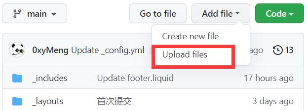

# 课程资源备份

<center>
    
</center>

如果你是在GitHub看到这些内容，欢迎前往[独立网页](https://课程.孝陵卫皇家理工大学.cn/)获得更好的访问体验。

这是一份开源文档，关于课程资料、实验报告、好的学习资源...

目前主要是控制类专业（自动化），电气工程（电力电子与电机方向）。

## 前言

一门课程再学习过程中会留下许多的学习痕迹：一些电子书、网络公开的学习课程、学习心得、走过的弯路。学会之后知识保存在大脑里，这些学习痕迹对个人而言就没用了，最终躺在硬盘里随着电脑一起报废。

这些学习痕迹，对于面对一个新知识体系不知如何下手的人来说，还是有价值的。因此我希望前人在学习路上跳过的坑，后来人都可以绕过。希望这些“痕迹”能产生一些新的价值。

## 主要内容

- 课程网络资源
- 参考教材
- 实验报告
- 小论文
- 考试相关的资料

包括但不限于上面列出的，一切对于知识的学习有帮助的内容。

## 如何贡献

如果你也愿意分享自己的学习心得、学习成果、好的学习资料，欢迎上传。

```warning
这些内容不建议上传

- 盗版、或需要付费的PDF电子书
- 破解软件及其安装包
- 课程ppt老师发布的资源等

>关于PPT：首先这属于老师的劳动成果，并且可能每年都会变化，也比较容易获得。其次PPT文件体积都挺大的，在github上传下载速度比较影响体验。

如果确实需要，可以将跳转链接整理到README文档里。如果仓库里的文件侵犯了您的权益，请[向我们发送邮件](mailto:m@njust.edu.cn) ，我们会尽快清除。
```

### 上传方式

如果你熟悉git和GitHub，那么贡献方式和其他开源项目一样，只需要注意[文件组织方式](#文件组织方式)即可。

如果你从未听说过上面的东西，没关系。跟着下面的步骤操作

- 1.在[GitHub](https://github.com)注册一个自己的账号
>**GitHub**是一个软件项目平台，这个项目所有的文件、你看到的这个网页的代码全部都托管在这个平台上。如果你将来可能会从事软件开发工作，那么注册一个账号将来一定会用得到。

- 2.进入[项目仓库](https://github.com/Control-and-Engineering/course-materials-backup)，点击右上角**Fork**
>此时你复制了这个仓库到你的账号下

- 3.1 上传文件到已有的课程文件夹
>打开对应课程文件夹，点击绿色Code按钮旁的Add file，选择Upload files，上传你的文件。

<center>
    
</center>

- 3.3 上传文件到新课程
>随便打开个课程文件夹，点击绿色Code按钮旁的Add file，选择Upload files。**把浏览器地址栏中文件夹名称改为你想要新建的文件夹名称，回车确认**，然后上传你的文件。


最后，如果你觉得自己操作太麻烦了，也可以直接用邮件附件发送到[m@njust.edu.cn]()。


### 文件组织方式

每个课程文件夹内，都会有一个名为`README.md`的文本文档，这个文档里有关于课程的一切说明。具体内容可以参考[控制工程基础README文档](https://raw.githubusercontent.com/Control-and-Engineering/course-materials-backup/main/%E6%8E%A7%E5%88%B6%E5%B7%A5%E7%A8%8B%E5%9F%BA%E7%A1%80/README.md)。

实验报告请按照完成年份来命名。如果压缩包内有照片，还请把照片体积压缩的小一点（[照片压缩工具下载](https://github.com/meowtec/Imagine)），能看清字即可。


一门课程的文件夹大概是这个样子

```
----课程名
  |--README.md
  |--2018-1.zip
  |--2018-2.zip
  |--2019-1.zip
  |--xxx.pdf
  |
```

在说明文档里使用如下语句
```
- [2018-1](./2018-1.zip)
- [2018-2](./2018-2.zip)
```

就可以实现文字链接效果。


## 相关资源

- [南京大学课程复习资料](https://github.com/idealclover/NJU-Review-Materials)
- [东南大学课程共享计划](https://github.com/zjdx1998/seucourseshare)
- [南京邮电大学通信工程](https://github.com/NJUPTFreeExams/NJUPT-TE-Free-Exams)
- [中国科学技术大学课程资源](https://github.com/USTC-Resource/USTC-Course)
- [上海交通大学课程分享](https://github.com/c-hj/SJTU-Courses)
- [浙江大学课程攻略共享计划](https://github.com/QSCTech/zju-icicles)
- [清华大学计算机系课程攻略](https://github.com/PKUanonym/REKCARC-TSC-UHT)
- [北京大学课程资料民间整理](https://github.com/lib-pku/libpku)
- [北大计算机课程大作业](https://github.com/tongtzeho/PKUCourse)
- [北京航空航天大学](https://github.com/TheBloodthirster/BUAA_Course_Sharing)
- [西安交通大学课程资料共享计划](https://github.com/cantjie/XJTU-Share)
- [中山大学课程资料分享](https://github.com/sysuexam/SYSU-Exam)
- [郑州大学课程复习资料](https://github.com/CooperNiu/ZZU-Courses-Resource)
- [东北大学机器人课程攻略 共享计划](https://github.com/mywisdomfly/NEU-RSE-Courses)


