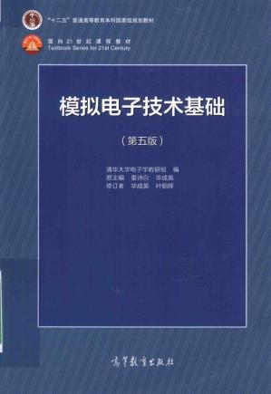

# 模拟电子线路

## 课程基本情况

- 学分：4
- 期末考核方式：考试

## 学习资源

### 视频课

- [华成英主讲 - 模拟电子技术基础](https://www.bilibili.com/video/BV19s411a7KL)
>也是属于经典教材的经典视频了，上课的补充。

### PDF书籍

    

- 模拟电子技术基础（第5版）- 童诗白，华成英原主编. 第5版. 978-7-04-042505-5
>经典书籍。和我们用的教材编排顺序略有区别，互相补充。

