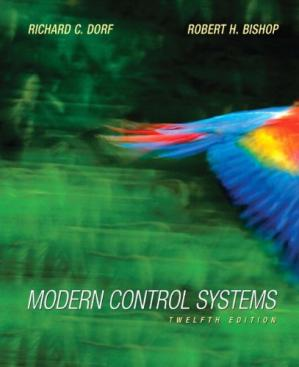
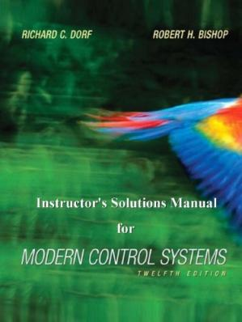
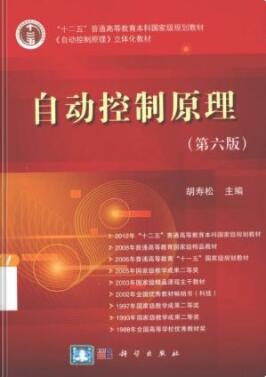

# 现代控制理论基础

## 课程基本情况

自动化专业为必修课
- 学分：3.5
- 期末考核方式：考试
- 成绩构成：
    - 闭卷笔试（70%）
    - 实验报告（15%）
    - 平时成绩（15%）

---

电气类为选修课
- 学分：3
- 期末考核方式：考试
- 成绩构成：
    - 闭卷笔试（70%）
    - 平时成绩（30%）

## 学习内容

现代控制理论基础是自动化专业同学的必修课，电气类专业可以选修。这门课程学习线性离散系统的分析、非线性系统分析、线性系统状态空间分析以及李雅普诺夫稳定性。

离散系统使用了离散的数学工具，传承了连续系统的分析思路。非线性系统有相平面法和描述函数法，相平面法的精髓是图，描述函数则是用了一些近似手段用经典方法分析非线性系统。状态空间理论是最重要的，掌握了这部分内容，才算是摸到了控制的门槛了。

## 实验报告

## 学习资源

### 视频课

- [《自动控制原理》西北工业大学 卢京潮](https://www.bilibili.com/video/BV1ZJ411c757)
>**必看经典**。可惜的是只有离散系统和非线性这两个章节，没有状态空间部分。

- [DR_CAN-现代控制理论](https://space.bilibili.com/230105574/channel/seriesdetail?sid=1569601)
- [DR_CAN-非线性控制理论](https://space.bilibili.com/230105574/channel/seriesdetail?sid=1569604)
>很强。醍醐灌顶，重点突出，思路清晰。

### PDF书籍

    

- Modern Control Systems - Richard C.Dorf, Robert H.Bishop.12th Edition. 9780136024583
>上课用书，英文原版

    

- Instructor's Solutions Manual for Modern Control Systems, 12th Edition. 7801360249
>上课用书的配套习题解析

    

- 现代控制系统（第十二版）. 9787121123351
>上课用书的中文版。

    

- 自动控制原理/胡寿松主编. 第6版. ISBN:978-7-03-037056-3
>电气类同学选修课的上课用书。

    

- 自动控制原理/卢京潮主编. 第2版. ISBN:978-7-302-31075-4
>和卢老师的视频配套的用书。逻辑清晰、重点突出，适合自学。

### 其他资源

