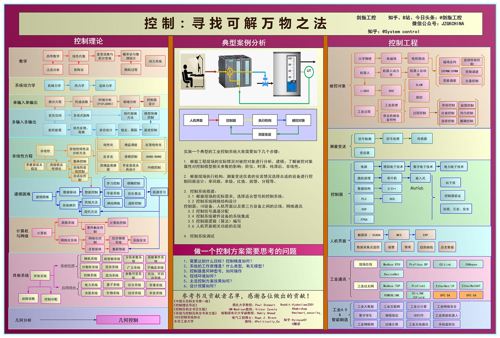
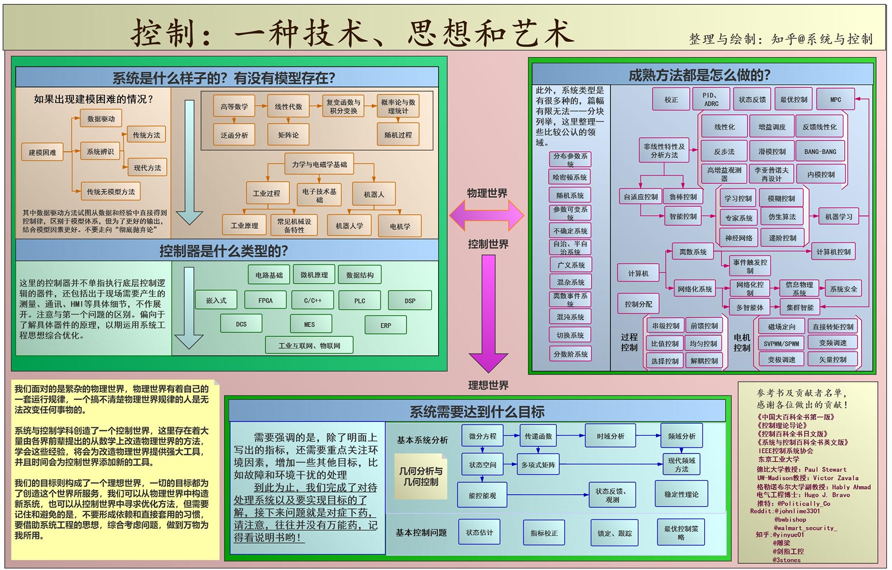

# 自动化学院

自动化学院的四个专业的同学虽然各有侧重方向，但是都绕不开自动化这个话题。关于自动化专业，知乎[@系统与控制](https://www.zhihu.com/people/xiang-yi-55-49)的[《自动化学科科普手册》](自动化学科科普手册.pdf)做了完整、全面、有深度的介绍。

自动化要学的东西“多且杂”，但是正因为多，自动化的同学可选方向就很多。同样来自[@系统与控制](https://www.zhihu.com/people/xiang-yi-55-49)的两张图，或许对自动化与控制相关专业同学的学习有所帮助。

 

可以看出，控制的范围要比自动化专业课程的范围更广泛，这也对自动化的同学提出了更高的要求。

---

资源贡献者：

|  |  |
| :--------------------: | :------------------: |
|       @Effun-141       |       @RaeChim       |

