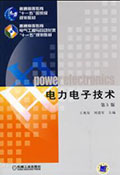
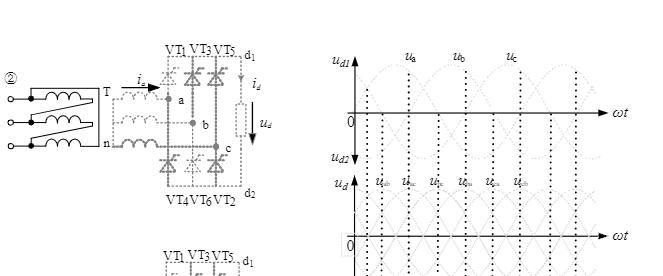

# 电力电子技术

## 课程基本情况

- 学分：3
- 期末考核方式：考试
- 成绩构成：
    - 闭卷笔试（70%）
    - 实验报告（10%）
    - 平时成绩（20%）

## 学习内容

电能变换和控制。学习各种功率元件，基本的电能变换电路的工作原理、波形等。

## 学习资源

### PDF书籍

    

- 电力电子技术（第5版）/王兆安, 刘进军主编
>上课用书

### 其他资源

- [4套期末试卷带答案](./4套试卷.zip)
- [课本习题答案](./电力电子技术(王兆安第五版)课后习题答案.docx)

- [带整流动画的ppt](./电力电子技术课件_整流电路有动画.pptx)
- [画整流波形图](./波形图.pdf)
>这两个文档用来学习整流波形。可以把PDF文档打印出来，描着底图画，特别好使。

